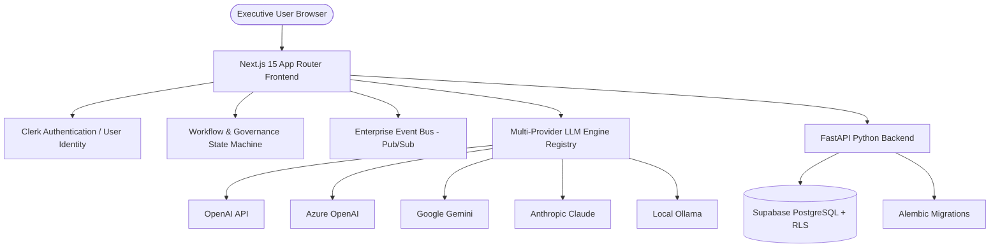

# System Architecture — AI Initiative Value Intelligence

## 1. Overview
**AI Initiative Value Intelligence** is an enterprise-grade C-suite decision intelligence, initiative portfolio management, financial realization tracking, and AI-assisted governance platform.

---

## 2. Platform Architecture Stack

---

## 3. Directory & Module Boundaries

- `apps/web/src/app/`: Next.js 15 App Router pages (`/business/portfolio`, `/business/initiatives`, `/business/ai-studio`, `/business/financials`, `/business/approvals`, `/business/admin`, `/business/notifications`, `/business/ai-playground`, `/business/integrations`).
- `apps/web/src/components/`: Reusable enterprise UI components grouped by domain (`ui/`, `dashboard/`, `initiatives/`, `ai/`, `financial/`, `portfolio/`, `workflow/`, `integration/`, `admin/`, `notifications/`, `collaboration/`, `ai-platform/`, `integrations/`).
- `apps/web/src/lib/`: React-decoupled pure TypeScript engines (`initiativeStore.ts`, `workflow/stateMachine.ts`, `integration/eventBus.ts`, `admin/rbacEngine.ts`, `automation/ruleEngine.ts`, `ai/promptLibrary.ts`, `ai/agentFramework.ts`, `integrations/syncEngine.ts`).
- `apps/web/src/services/`: Service abstraction layer mapping 1:1 to FastAPI backend endpoints.
- `apps/api/src/`: FastAPI Python application with SQLAlchemy 2.0 ORM, Pydantic v2 schemas, and PostgreSQL RLS tenant isolation.

---

## 4. Multi-Tenant Security & Isolation
Tenant isolation is enforced at the database layer via PostgreSQL Row Level Security (RLS) policies linking `organization_id` on every query.
