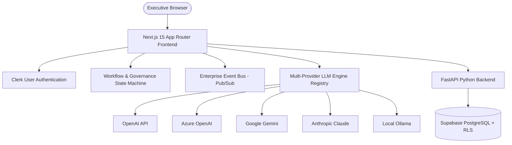

# AI Initiative Value Intelligence

[](#)
[](#)
[](#)
[](#)
[](#)
[](#)

## 1. Project Overview
**AI Initiative Value Intelligence** is a production-grade strategic portfolio command center, financial realization dashboard, and governance platform designed for C-suite executives to model, analyze, and oversee enterprise artificial intelligence projects.

---

## 2. Problem Statement
Many enterprise AI initiatives exceed budgets or fail to deliver estimated return on investment (ROI) due to fragmented tracking, siloed financial forecasts, and non-standardized compliance review cycles. This platform unifies the complete AI project lifecycle into a single operational interface.

---

## 3. Key Features
- **Executive Command Center**: High-level ROI metrics, net realized savings summaries, and department benchmarking.
- **5-Step Setup Wizard**: Structured input wizard validating budgets, expected business cases, and key lead assignees.
- **AI Decision Studio**: Interactive recommendations with confidence scores, risk explainability, and multi-scenario what-if modeling.
- **Financial Intelligence**: Dynamic benefits realization logs, cash flow curves, and CAPEX/OPEX cost allocation registers.
- **Workflow & Governance state-machine**: 8-stage project review gate state machine tracking SLA timers and audit events.
- **Centralized Event Bus**: Event-driven architecture executing automatic notifications and custom rules based on budget thresholds.
- **AI Playground & Agent Registry**: Provider-agnostic playground supporting streaming outputs, cost tracking, and specialized agents.
- **Connected Ecosystem**: Catalog grid supporting webhooks, OAuth token mappings, and Power BI sync logs.

---

## 4. System Architecture



---

## 5. Technology Stack
* **Frontend**: Next.js 15 (React 19), Tailwind CSS, Lucide icons, Recharts.
* **Backend**: Python 3.10+, FastAPI, SQLAlchemy 2.0 ORM, Alembic.
* **Database**: PostgreSQL (Supabase VNet isolated) with Row Level Security (RLS) tenant isolation.
* **Authentication**: Clerk Enterprise Identity Management.
* **AI Engine**: Provider-agnostic registry (OpenAI, Azure, Gemini, Anthropic, Ollama).
* **Deployment**: Docker, Vercel, Render.

---

## 6. Folder Structure

```
├── apps/
│   ├── web/          # Next.js 15 App Router Frontend
│   └── api/          # FastAPI Python REST Backend
├── ARCHITECTURE.md   # Detailed System Architecture
├── DEPLOYMENT.md     # Production Deployment Guide
├── API_GUIDE.md      # API Reference Specification
├── DEVELOPER_GUIDE.md# Developer Local Setup Guide
└── README.md         # Master Repository README
```

---

## 7. Setup & Run Instructions

### Environment Configuration

#### Next.js Web (`apps/web/.env`)
```env
NEXT_PUBLIC_CLERK_PUBLISHABLE_KEY=pk_test_...
CLERK_SECRET_KEY=sk_test_...
NEXT_PUBLIC_API_URL=http://localhost:8000
```

#### FastAPI API (`apps/api/.env`)
```env
DATABASE_URL=postgresql+psycopg://...
CLERK_SECRET_KEY=sk_test_...
```

### Running Locally

```bash
# Start Frontend
cd apps/web
npm install
npm run dev

# Start Backend
cd apps/api
python -m venv venv
.\venv\Scripts\activate
pip install -r requirements.txt
uvicorn src.main:app --reload
```

---

## 8. Testing Commands
- **Frontend Type Verification**: `npm run type-check` (inside `apps/web`)
- **Backend Python Tests**: `pytest` (inside `apps/api`)

---

## 9. Roadmap & Future Enhancements
- [ ] Bidirectional real-time Slack/Teams incoming chat notifications.
- [ ] Vector database integration (RAG) for localized enterprise policies.
- [ ] Predictive ML cost warning triggers via historical telemetry.

---

## 10. Contributing & License
Distributed under the MIT License. See `CONTRIBUTING.md` for guidelines.

- **GitHub Repository**: [Kunal-77/AI-Initiative-Value-Intelligence](https://github.com/Kunal-77/AI-Initiative-Value-Intelligence)
