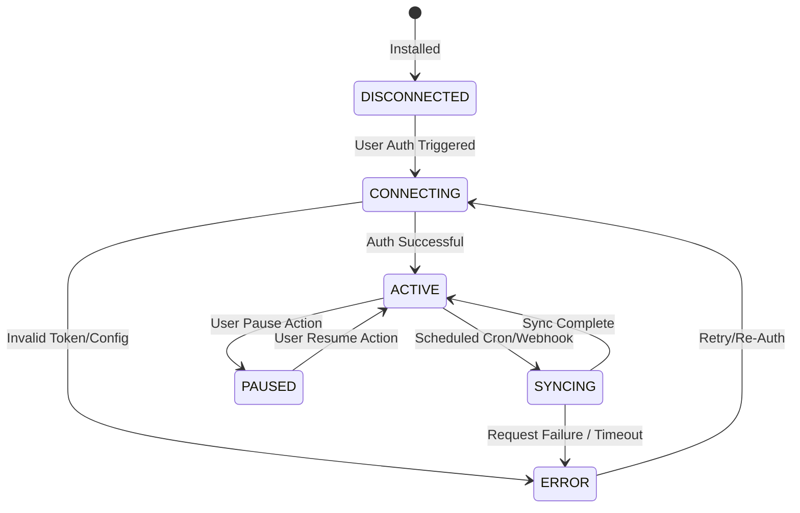

# AI Initiative Value Intelligence

## Data Connectors Specification v0.1

**Status:** Draft / Technical Specification\
**Owner:** Core Platform Engineering\
**Last Updated:** August 2026

---

# 1. Executive Summary

This document specifies the architecture of the platform's Data Ingestion Engine. It defines the state transition model, background task scheduling, incremental syncing logic, and data security controls for both Business and Personal connectors.

---

# 2. Connector State Engine & Lifecycle

Every integrated connector (e.g. AWS Billing, Gmail Receipt Scraper) is registered in the database and manages its execution lifecycle through defined state transitions.



### 2.1 Connector States Definitions
* **DISCONNECTED:** The connector is registered but has no valid credentials.
* **CONNECTING:** The system is validating OAuth tokens, cross-account ARNs, or API key parameters.
* **ACTIVE:** Validation succeeded; the connector is ready to process schedules.
* **SYNCING:** A background worker is actively pulling, normalizing, and writing data.
* **ERROR:** The last sync run failed due to authentication, network timeouts, or schema violation issues.
* **PAUSED:** Sync execution is temporarily suspended by user configuration.

---

# 3. Ingestion Engine Pipeline

```
+---------------+     +-----------------------+     +-------------------+
| External API  | --> | Normalization Worker  | --> |  DuckDB / Polars  |
| / CSV Upload  |     |   (FastAPI / Celery)  |     | Analytics Engine  |
+---------------+     +-----------------------+     +-------------------+
                                                              |
                                                              v
+---------------+     +-----------------------+     +-------------------+
| SQL Database  | <-- |   Object Storage      | <-- | Deduplication &   |
| (PostgreSQL)  |     | (S3 Raw Data Lake)    |     | Aggregation Layer |
+---------------+     +-----------------------+     +-------------------+
```

## 3.1 Ingestion Pipeline Stages
1. **Fetch/Receive:** Ingests raw data via scheduled cron tasks (Pull) or webhook events (Push).
2. **Buffer Storage:** Persists raw JSON/CSV payload to S3-compatible storage.
3. **Parse & Normalize:** Processes large log sets using **Polars** and **DuckDB** to calculate rolling aggregates, stripping non-essential fields.
4. **Deduplicate:** Employs unique transaction IDs or checksums to avoid writing duplicate observations.
5. **Write Ledger:** Writes metric observations and financial cost items to the relational PostgreSQL database.

---

# 4. Ingestion Management Policies

## 4.1 Incremental Syncing
To minimize network and API query overhead, connectors use incremental cursor strategies:
* **Time Cursors:** Querying only transactions where `created_at` is greater than the last successful sync timestamp (`last_sync_timestamp`).
* **Sequence ID Cursors:** Utilizing transaction sequence identifiers to fetch records generated since the last processed ID.

## 4.2 Conflict Resolution
When raw updates collide with manually overridden dashboard cells:
* **Manual Override Lock:** User-edited metrics in the UI are flagged as `is_manual_override = true` in PostgreSQL.
* **Rule:** Connector syncs *never* overwrite rows locked by manual override. The system flags the sync as `OVERRIDDEN_MERGE` and logs the audit history.

## 4.3 Caching & Data Freshness
* **Read-Through Cache:** Analytical summaries and ROI aggregates are cached in Redis with a Time-To-Live (TTL) of 4 hours.
* **Force Refresh:** Org Admins can trigger manual syncs, which bypasses cache and queries external connectors directly (limited to once per 15 minutes per connector).

---

# 5. Health Monitoring & Alerting

* **Heartbeat Monitor:** A cron task evaluates the status of all active connectors every hour. If a connector remains in `SYNCING` state for >3 hours, it is flagged as `TIMEOUT_STUCK` and reset to `ERROR`.
* **Consecutive Failures Alert:** If a connector enters the `ERROR` state 3 consecutive times, the system:
  1. Sends a notification hook to Slack/Email.
  2. Disables background scheduling for the connector until the token is verified.
* **Credential Rotation Schedule:** API Keys and OAuth tokens must be rotated every 90 days. The platform displays warning indicators in the user Settings panel 7 days prior to token expiration.
