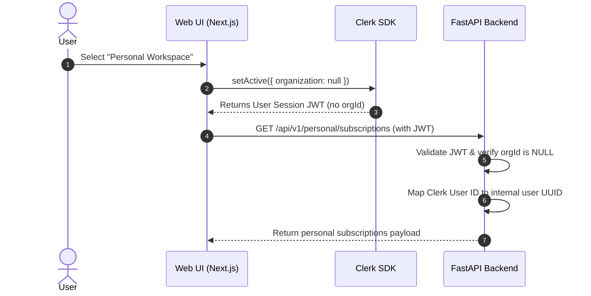

# AI Initiative Value Intelligence

## Identity & Workspace Architecture Specification v0.1

**Status:** Draft / Technical Specification\
**Owner:** Architecture & Security Teams\
**Last Updated:** August 2026

---

# 1. Executive Summary

This document defines the identity, authentication, and workspace architecture of the Value Intelligence platform. It outlines how Clerk is utilized to segregate organizational tenancy from individual user workspaces. It specifies role permissions, session flows, and workspace switching behaviors, ensuring the operational independence of the Business and Personal environments.

---

# 2. Authentication & Identity Layer (Clerk)

The platform delegates core identity management, password verification, social login, and MFA flows to **Clerk**. Clerk provides tokens validating the user's active session, email address, and organization memberships.

```
                  +--------------------+
                  |     Clerk API      |
                  +--------------------+
                            | (Session Token)
                            v
+--------+       +----------------------+       +--------------------+
| Client | ----> |  FastAPI middleware  | ----> |  Backend Database  |
+--------+       +----------------------+       +--------------------+
```

---

# 3. Workspace Selection Contexts

The platform supports two distinct workspace scopes, toggled by the frontend Workspace Selector:

## 3.1 Organization Context (Business Workspace)
* **Description:** Represents an enterprise workspace owned by a corporation or department.
* **Mapping:** Activated when Clerk’s session token contains a valid `org_id` (representing a Clerk Organization).
* **Teancy Boundary:** All API data calls default to the mapped internal `organization_id` corresponding to that Clerk organization.
* **RBAC:** Enforced through roles assigned to the user membership inside that organization.

## 3.2 Personal Context (Personal Workspace)
* **Description:** Represents the isolated space of an individual user, tracking personal costs and subscriptions.
* **Mapping:** Activated when Clerk's session token does *not* contain an `org_id` (`orgId` is `null` or `undefined`).
* **Tenancy Boundary:** API calls evaluate only the user's token mapping to their unique internal `user_id`. No organization memberships are evaluated.

---

# 4. Workspace Selector Session Flow

When a user switches workspaces, the application performs a client-side navigation that alters the active Clerk organization token and redirects the browser:



---

# 5. Permission & Role Model

The platform segregates access control policies based on the active workspace context:

## 5.1 Business Workspace Roles (RBAC)
Business workspace permissions are mapped to Clerk organization roles as defined in authorization services:

| Role | Clerk Role Mapping | Capabilities |
| :--- | :--- | :--- |
| `ORG_ADMIN` | `org:admin`, `admin` | Full workspace CRUD, financial settings, metric validations, decision records, workspace invitations. |
| `INITIATIVE_OWNER` | User assigned ownership | Create/edit initiatives, assign metrics, upload observations, review plans. |
| `REVIEWER` | `org:reviewer` | Read-only view, record validate/review annotations, request adjustments. |
| `VIEWER` | `org:member`, `member` | Read-only access to portfolio dashboards and metrics. |

## 5.2 Personal Workspace Roles (Single Owner)
* **Model:** Single-owner permission model.
* **Access Rule:** The owner holds full CRUD capabilities over their personal workspace data. There are no secondary roles (Viewers or Reviewers) inside a Personal Workspace by default.

---

# 6. Future Expansion Roadmap

The architecture is designed to support the following future evolution paths:

## 6.1 Enterprise Single Sign-On (SSO)
* **Description:** Integrate SAML/OIDC via Clerk Enterprise features to provision users automatically from Azure AD, Okta, or Google Workspace.
* **Architecture:** Enterprise users will be locked to their designated `Business Workspace` and prevented from exporting corporate evidence or creating overlapping profiles.

## 6.2 Multiple Personal Profiles
* **Description:** Allow users to separate "Individual Consumer" expenses from "Freelancer / Micro-Business" accounts.
* **Architecture:** Introduce a `personal_workspaces` table containing a user UUID and a workspace type tag (`CONSUMER` vs. `FREELANCE`).

## 6.3 Family Workspace
* **Description:** Enable shared billing tracking for families (e.g. gym memberships, Netflix shared accounts) with multi-user access.
* **Architecture:** Introduce a `personal_workspace_memberships` table mapping users to a shared personal workspace ID with roles `OWNER` and `CONTRIBUTOR`.

## 6.4 Multi-Business Workspace Switcher
* **Description:** Enable agencies or advisors to switch between multiple business tenants.
* **Architecture:** Managed natively by Clerk's organization switcher dropdown, dynamically updating active `orgId` headers in API requests.
